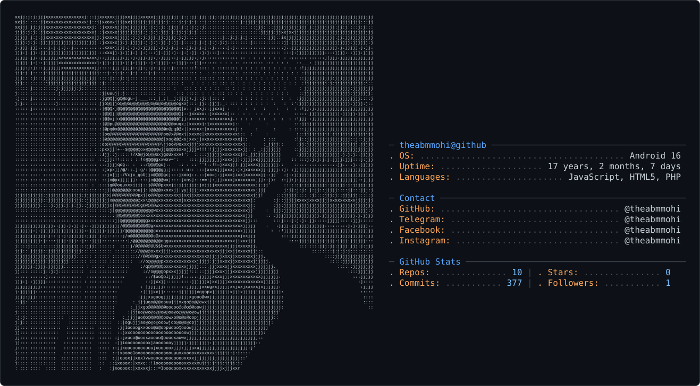

<picture>
  <source media="(prefers-color-scheme: dark)" srcset="dark_mode.svg" />
  <source media="(prefers-color-scheme: light)" srcset="light_mode.svg" />
  
</picture>

<div align="center">


<br/>
<a href="https://t.me/theabmmohi"></a>
<br/>
<a href="https://facebook.com/theabmmohi"></a>
<br/>
<a href="https://instagram.com/theabmmohi"></a>

</div>

<br/>

```yaml
name        : Im ABM
handle      : @theabmmohi  # everywhere, literally
status      : $ learning --mode=always
profession  : Student & Aspiring Developer :)
coffee_dep  : true
bug_creator : true
bug_fixer   : sometimes
```

> *"Iꜰ Yᴏᴜ Wᴇʀᴇ Tᴏ Tᴜʀɴ Iɴᴛᴏ A Sɴᴀᴋᴇ Tᴏᴍᴏʀʀᴏᴡ Aɴᴅ Bᴇɢɪɴ Dᴇᴠᴏᴜʀɪɴɢ Hᴜᴍᴀɴꜱ, Aɴᴅ Fʀᴏᴍ Tʜᴇ Sᴀᴍᴇ Mᴏᴜᴛʜ Yᴏᴜ Dᴇᴠᴏᴜʀᴇᴅ Hᴜᴍᴀɴꜱ, Yᴏᴜ Cʀɪᴇᴅ Oᴜᴛ Tᴏ Mᴇ 'I Lᴏᴠᴇ Yᴏᴜ!' — Wᴏᴜʟᴅ I Sᴛɪʟʟ Bᴇ Aʙʟᴇ Tᴏ Sᴀʏ 'I Lᴏᴠᴇ Yᴏᴜ' Tʜᴇ Sᴀᴍᴇ Wᴀʏ I Dᴏ Tᴏᴅᴀʏ?"* - Gin, Bleach

> *"A Tʀᴜᴇ Wᴀʀʀɪᴏʀ Dᴏᴇꜱɴ'ᴛ Nᴇᴇᴅ A Sᴡᴏʀᴅ."* - Thors, Vinland Saga

<br/>

<!-- TECH-STACK:START -->
<div align="center">


</div>
<!-- TECH-STACK:END -->

<br/>

<div align="center">


<br/><br/>


</div>

<br/>

<div align="center">


</div>

<div align="center">

`Visitors since THAT day:`<br/><br/>

<br/><br/>
<a href="https://www.supportkori.com/theabmmohi"></a>

</div>

<div align="center">


</div>